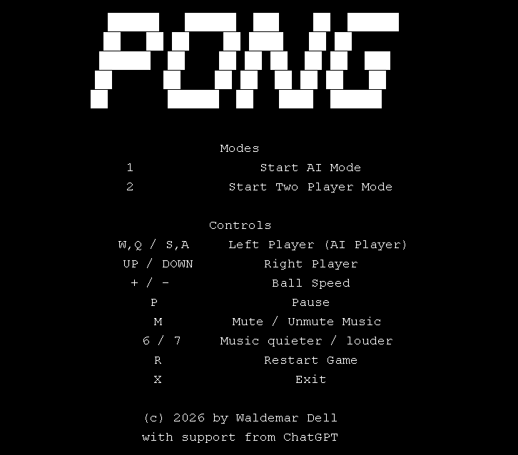
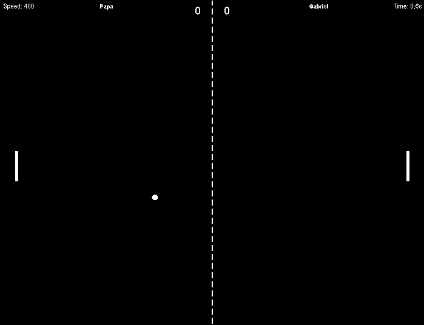

# Pong




**Pong**
is a polished retro arcade experience built in Java and designed to feel fast, responsive, and fun from the very first rally. It combines classic Pong gameplay with modern quality-of-life features, animated screens, configurable settings, sound effects, background music, and a surprisingly lively presentation.

Whether you want a quick match against the computer or a competitive two-player duel, this project delivers a clean old-school style with a richer gameplay layer.

## Features

- **Classic Pong gameplay** with smooth paddle and ball movement
- **Smooth 60 FPS gameplay** for a responsive arcade feel
- **Two game modes**
  - AI mode
  - Local two-player mode
- **Configurable AI difficulty** with multiple skill levels
- **Configurable game settings** via `config.properties`
  - window size
  - max score
  - player names
  - sound and music toggles
- **Animated start flow** with a countdown before the match begins
- **Pause system** with matching background music pause/resume behavior
- **Background music support** with mute and live volume control
- **Retro sound effects** for paddle hits, wall collisions, and scoring
- **Dynamic HUD** showing score, speed, elapsed time, and player names
- **Matchball notification** for high-pressure moments
- **Animated Game Over screen** with colorful winner presentation
- **Keyboard controls** for gameplay, pause, restart, music, and speed tuning

## Controls

- `1` — Start AI mode
- `2` — Start two-player mode
- `W / Q` — Left paddle up
- `S / A` — Left paddle down
- `Up / Down` — Right paddle movement
- `+ / -` — Increase / decrease ball speed
- `P` — Pause / resume
- `M` — Mute / unmute background music
- `6 / 7` — Background music quieter / louder
- `R` — Restart to start screen
- `X` — Exit the game
- `SPACE` — Rematch on Game Over

## Technology

- **Java**
- **Swing / AWT** for rendering and desktop UI
- **Custom game loop** for smooth frame-based gameplay

## Build and Run

Make sure a **JDK** is installed and that `javac`, `jar`, and `java` are available on your `PATH`.

The project includes ready-to-use compile scripts for both Windows and Linux. Both scripts:

- compile the Java source files
- copy all resources into the build output
- create the runnable `pong.jar`

### Windows

Use the batch script in the project root:

```bat
compile.bat
```

### Linux

Make the script executable once, then run it:

```bash
chmod +x compile
./compile
```

### Start the game

After a successful build, start the game with:

```bash
java -jar pong.jar
```

## Library

This project uses **JLayer** to play MP3 background music.

- Library: `JLayer 1.0.1`
- Purpose: MP3 playback for the in-game music track

## License

This project is released under the **MIT License**.

See the [`LICENSE`](LICENSE) file for details.

## Credits

Created by **Waldemar Dell** with support from **ChatGPT**.
